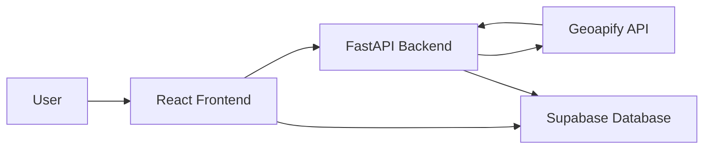

# Sustentar Diagnostic

A web-based decision-support tool for evaluating municipal sustainable mobility using real-time spatial data and a structured assessment framework.

## Overview

Sustentar Diagnostic helps planners, researchers, and policymakers assess urban mobility conditions through an interactive diagnostic workflow. The platform combines user-provided inputs with external geospatial data sources to generate standardized indicators related to active mobility, public transport accessibility, and transport infrastructure.

The project was developed as part of a broader effort to support evidence-based urban mobility planning and make complex spatial datasets more accessible to non-technical stakeholders.

## Problem

Urban mobility data is often fragmented across multiple sources, making it difficult for decision-makers to evaluate transportation systems without specialized technical expertise. Existing datasets may be available, but extracting actionable insights frequently requires GIS knowledge, data processing skills, or access to specialized software.

## System Architecture

### Data Flow



### Architecture Components

- **Frontend (React/Vite):** User interface and diagnostic workflow
- **Backend (FastAPI):** Data processing, API orchestration, caching, and indicator generation
- **Supabase:** Storage for user submissions and application data
- **Geoapify:** Geospatial data provider for mobility and infrastructure metrics

## Key Features

- Multi-step diagnostic workflow
- Real-time spatial data integration
- Automated indicator generation
- Backend caching for improved performance
- User feedback collection
- City-level mobility assessment

## Technology Stack

| Layer | Technology |
|---------|------------|
| Frontend | React, Vite |
| Backend | FastAPI, Python |
| Database | Supabase |
| External APIs | Geoapify |
| Deployment | Vercel (Frontend), Railway (Backend) |

## Environment Variables

### Backend

```env
SUPABASE_URL=
SUPABASE_KEY=
GEOAPIFY_KEY=
```

### Frontend

```env
VITE_API_URL=
```

## Local Development

### Frontend

```bash
cd frontend
npm install
npm run dev
```

### Backend

```bash
cd backend

python -m venv venv
source venv/bin/activate

pip install -r requirements.txt

uvicorn main:app --reload
```

## API Endpoints

| Method | Endpoint | Description |
|----------|------------|------------|
| GET | /api/health | Service health check |
| GET | /api/spatial/{city_name} | Retrieve city mobility data |
| POST | /api/feedback | Submit user feedback |

## Deployment

- Frontend: Vercel
- Backend: Railway
- Database: Supabase

## Repository Structure

```text
frontend/     React application
backend/      FastAPI service
README.md     Project documentation
```
